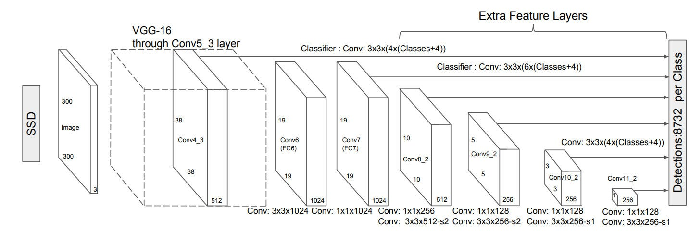
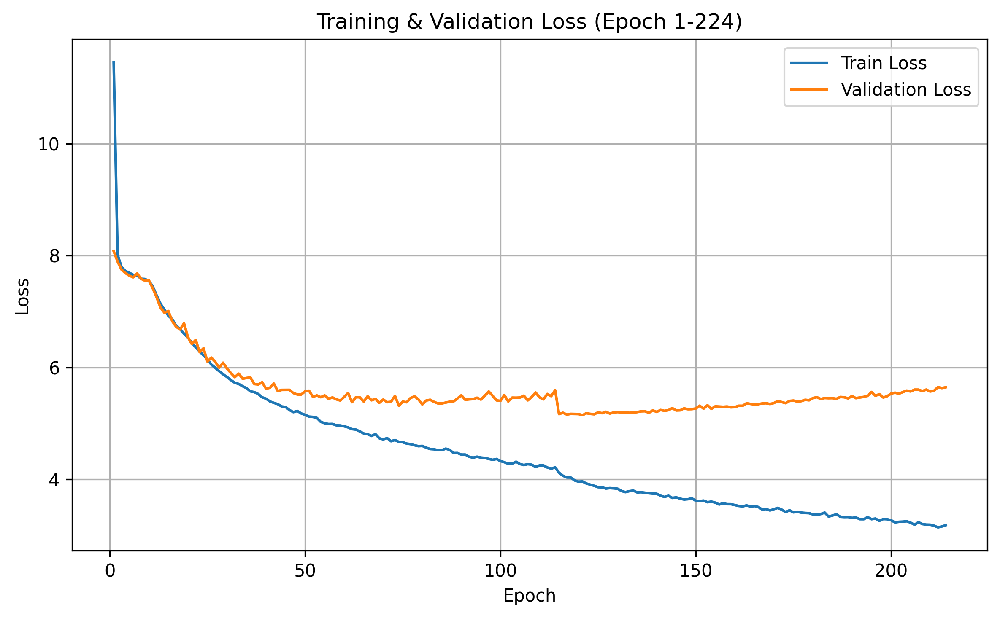

#  Single Shot MultiBox Detector (SSD)

[](https://www.python.org/)
[](https://pytorch.org/)
[](https://lightning.ai/docs/torchmetrics/stable/)
[](LICENSE)

A clean PyTorch implementation of the SSD (Single Shot MultiBox Detector) architecture for object detection on Pascal VOC.

<p align="center">
  
</p>

## Highlights

This section summarizes the key ideas and strengths of the project. It is a quick snapshot of what the repository provides and why it is useful. Use it to decide if the project fits your goals.

- Modular SSD implementation with backbone, extra feature layers, prediction heads, and prior box generation.
- YAML-driven configuration for model, training, and evaluation.
- End-to-end pipeline for training, inference, and evaluation.
- Detection evaluation with `mAP`, `mAP@50`, `mAP@75`, precision, recall, and F1.

## Repository Structure

This section explains how the repository is organized. It helps you locate code, configs, data, and scripts quickly. Skim this first if you are new to the project.

```
ssd-from-scratch/
│
├── configs/                 # All configuration files
│   ├── data/                # Dataset configs
│   │   └── voc.yaml
│   ├── model/               # Model architecture configs
│   │   ├── ssd300.yaml
│   │   └── ssd512.yaml
│   ├── train.yaml           # Training config
│   └── evaluate.yaml        # Evaluation config
│
├── data/                    # Dataset + augmentation
│   ├── voc.py               # VOC dataset loader
│   └── transform.py         # Data preprocessing & augmentation
│
├── model/                   # SSD model components
│   ├── backbone/            # Feature extractor (e.g., VGG)
│   ├── head/                # Classification & regression heads
│   ├── prior/               # Prior (default) box generation
│   ├── ssd.py               # Main SSD model
│   └── utils.py             # Model helper functions
│
├── loss/                    # Loss computation
│   ├── matcher.py           # Ground-truth matching logic
│   └── multibox_loss.py     # SSD MultiBox loss
│
├── training/                # Training pipeline
│   ├── trainer.py           # Training loop
│   ├── evaluator.py         # mAP evaluation
│   ├── dataloader.py        # DataLoader builder
│   ├── scheduler.py         # LR scheduler
│   └── checkpointer.py      # Save & load checkpoints
│
├── utils/                   # General utilities
│   ├── iou.py               # IoU computation
│   ├── nms.py               # Non-Maximum Suppression
│   ├── visualize.py         # Visualization tools
│   ├── logging.py           # Logging setup
│   └── transform.py         # Shared transform utilities
│
├── notebooks/               # Experiments & debugging
├── sample/                  # Sample images
├── weights/                 # Saved model weights
│
├── config.py                # Global config loader
├── train.py                 # Training entry point
├── evaluate.py              # Evaluation script
├── inference.py             # Inference script
│
├── requirements.txt
├── README.md
└── LICENSE
```

## Getting Started

This section walks you through preparing your environment. It covers dependencies, setup steps, and any required downloads. Follow it to get a clean local run.

### Prerequisites

- Python 3.8+
- CUDA-capable GPU (recommended for training)

### Installation

Clone the repository:

```bash
git clone https://github.com/your-username/ssd-from-scratch.git
cd ssd-from-scratch
```

Create and activate a virtual environment:

```bash
python -m venv venv

# Windows
venv\Scripts\activate

# Linux/macOS
source venv/bin/activate
```

Install dependencies:

```bash
pip install -r requirements.txt
```

## Usage

This section shows how to use the project end to end. You will learn how to configure experiments, train the model, run inference, and evaluate results. Use it as your main workflow guide.

### Configuration

Model and training configurations are defined in YAML files.

Model configuration (`configs/model/ssd300.yaml`):

```yaml
num_classes: 21
image_size: 300
feature_map_resolutions: [38, 19, 10, 5, 3, 1]
box_scales: [0.1, 0.2, 0.37, 0.54, 0.71, 0.88]
box_variances: [0.1, 0.2]
box_clip: true
num_boxes: [4, 6, 6, 6, 4, 4]
```

Training configuration (`configs/train.yaml`):

```yaml
batch_size: 64
epochs: 150
grad_accumulation_steps: 1
gradient_clip_norm: 1.0
optimizer: adam
learning_rate: 0.00001
gamma: 0.9
weight_decay: 0.0001
device: cpu
num_workers: 2
seed: 42
```

### Anchors and Default Boxes

The project uses SSD prior boxes (default boxes) generated from feature map resolutions, scales, and aspect ratios in model config.

Key settings:

| Setting | Description |
|------|-------------|
| `feature_map_resolutions` | Feature map sizes used for detection heads |
| `box_scales` | Relative scales for default boxes |
| `box_aspect_ratios` | Aspect ratios per feature map |
| `box_variances` | Variances used for box encoding/decoding |

### Training

Train the SSD model:

```bash
python train.py --device cuda --batch-size 32 --epochs 50
```

Arguments:

| Argument | Description | Default |
|----------|-------------|---------|
| `--resume` | Path to checkpoint for resuming | `None` |
| `--device` | Training device (`cuda` or `cpu`) | Config value |
| `--batch-size` | Override batch size from config | Config value |
| `--epochs` | Override number of epochs | Config value |

Resume training from checkpoint:

```bash
python train.py --resume weights/checkpoint.pt
```

### Inference

Run object detection on an image:

```bash
python inference.py \
  --image-path sample/sample_1.jpg \
  --checkpoint weights/checkpoint.pt \
  --conf-threshold 0.6 \
  --iou-threshold 0.45 \
  --device cpu
```

| Argument | Description | Default |
|----------|-------------|---------|
| `--image-path` | Path to input image | Required |
| `--checkpoint` | Path to model checkpoint | `./weights/checkpoint.pt` |
| `--top-k` | Max detections per class | `200` |
| `--conf-threshold` | Confidence threshold | `0.6` |
| `--iou-threshold` | IoU threshold for NMS | `0.45` |
| `--device` | Inference device | `cpu` |
| `--show` | Visualize detections | `True` |

### Evaluation

Evaluate the model on the VOC test split:

```bash
python evaluate.py \
  --checkpoint ./weights/checkpoint.pt \
  --batch-size 32 \
  --conf-threshold 0.9 \
  --iou-threshold 0.45 \
  --device cpu
```

| Argument | Description | Default |
|----------|-------------|---------|
| `--checkpoint` | Path to trained model | Config value |
| `--batch-size` | Evaluation batch size | Config value |
| `--num-workers` | DataLoader worker count | Config value |
| `--conf-threshold` | Confidence threshold | Config value |
| `--iou-threshold` | IoU threshold for NMS and matching | Config value |
| `--device` | Evaluation device | Config value |

Evaluation metrics:

- `mAP`
- `mAP@50`
- `mAP@75`
- `Precision@0.5`
- `Recall@0.5`
- `F1@0.5`

## Experiments

This section provides an overview of the experimental setup, training behavior, and evaluation results of the SSD model on Pascal VOC, including optimization dynamics and detection quality.

### Training Curves

Track training and validation loss from your runs (for example, by logging trainer history from `training/trainer.py`) to monitor convergence and overfitting.

<p align="center">
  
</p>

* The training loss decreases steadily, showing stable optimization.
* Validation loss improves during early epochs but begins to rise slightly after ~**epoch 100**, suggesting mild **overfitting**.
* The gap between training and validation loss gradually widens in later epochs.
* Early stopping around the minimum validation loss could improve generalization.

#### Experimental Setup

<details>
<summary><strong>Training Configuration</strong></summary>

- Batch size: 64
- Epochs: 150
- Optimizer: Adam (lr = 1e-5, weight_decay = 1e-4)
- Gradient accumulation: 1
- Gradient clipping: 1.0
- Device: CPU (default, configurable)
- Seed: 42

</details>

<details>
<summary><strong>Model Configuration</strong></summary>

- Architecture: SSD300
- Backbone: VGG-style feature extractor
- Input size: 300x300
- Number of classes: 21 (VOC + background)
- Feature maps: [38, 19, 10, 5, 3, 1]
- Boxes per feature map: [4, 6, 6, 6, 4, 4]

</details>

### Test Evaluation

The evaluation pipeline computes both standard detection mAP metrics and threshold-based precision/recall/F1 for a practical view of model behavior.

#### Quantitative Results

| Metric | Description | Score |
|------|-------------|------:|
| `mAP` | Mean AP across IoU thresholds 0.50:0.95 | 0.119 |
| `mAP@50` | AP at IoU = 0.50 | 0.353 |
| `mAP@75` | AP at IoU = 0.75 | 0.049 |
| `Precision@0.5` | Class-averaged precision at IoU 0.5 | 0.736 |
| `Recall@0.5` | Class-averaged recall at IoU 0.5 | 0.401 |
| `F1@0.5` | Class-averaged F1 at IoU 0.5 | 0.505 |

#### Results Interpretation

Interpret metrics jointly for a balanced understanding of detector quality:

- `mAP`/`mAP@50`/`mAP@75` indicate localization and ranking quality across IoU settings.
- `Precision@0.5` and `Recall@0.5` expose confidence-threshold tradeoffs.
- `F1@0.5` gives a single summary of precision-recall balance for quick comparison between runs.

## License

This project is licensed under the MIT License. See `LICENSE`.

## References

This section lists the key papers and resources behind this implementation. It gives proper credit and provides useful background reading.

- [SSD: Single Shot MultiBox Detector](https://arxiv.org/abs/1512.02325)
- [Pascal VOC Challenge](http://host.robots.ox.ac.uk/pascal/VOC/)
- [TorchMetrics Mean Average Precision](https://lightning.ai/docs/torchmetrics/stable/detection/mean_average_precision.html)
